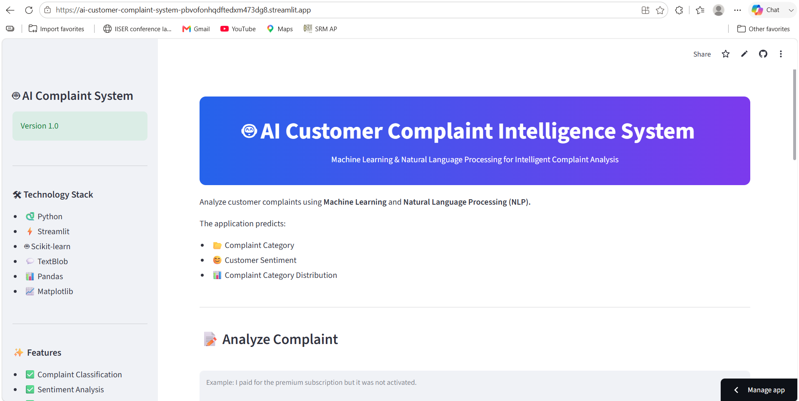
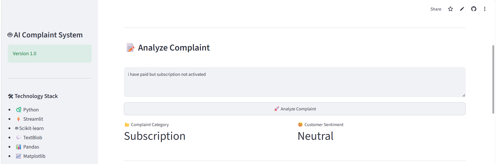
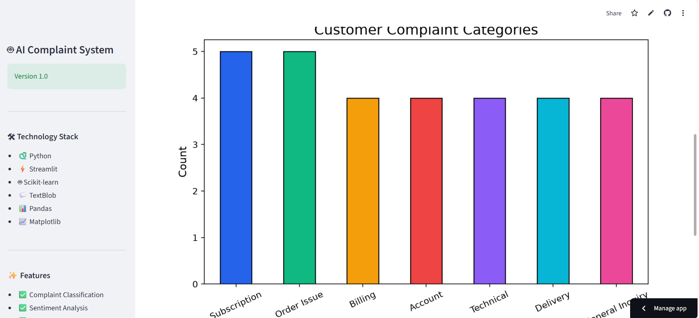

# 🤖 AI Customer Complaint Intelligence System

An AI-powered Customer Complaint Intelligence System built using **Machine Learning**, **Natural Language Processing (NLP)**, and **Streamlit**. The application automatically classifies customer complaints into predefined categories and performs sentiment analysis in real time.

## 🌐 Live Demo

👉 https://ai-customer-complaint-system-pbvofonhqdftedxm473dg8.streamlit.app/

---

## 📌 Features

- 🤖 Machine Learning-based complaint classification
- 😊 Real-time sentiment analysis
- 📊 Interactive complaint category visualization
- 📝 User-friendly Streamlit interface
- ⚡ Fast and lightweight prediction system
- 📈 Complaint category distribution chart

---

## 🛠 Tech Stack

| Category | Technologies |
|----------|--------------|
| Language | Python |
| Framework | Streamlit |
| Machine Learning | Scikit-learn |
| NLP | TextBlob |
| Data Processing | Pandas |
| Visualization | Matplotlib |

---

## 📂 Project Structure

```text
AI-Customer-Complaint-System
│
├── app.py
├── model.py
├── data.csv
├── requirements.txt
├── README.md
└── .gitignore
```

---

## 🚀 Installation

Clone the repository

```bash
git clone https://github.com/udayreddyga/AI-Customer-Complaint-System.git
```

Move to the project directory

```bash
cd AI-Customer-Complaint-System
```

Install dependencies

```bash
pip install -r requirements.txt
```

Run the application

```bash
streamlit run app.py
```

---

## 💡 How It Works

1. Enter a customer complaint.
2. The trained Machine Learning model predicts the complaint category.
3. TextBlob analyzes the complaint sentiment.
4. Results are displayed instantly.
5. Complaint category distribution is visualized using charts.

---

## 📸 Screenshots

### 🏠 Home Page

<p align="center">
  
</p>

---

### 📝 Complaint Input

<p align="center">
  
</p>

---

### 🤖 Prediction Result

<p align="center">
  
</p>

---

### 📊 Complaint Category Distribution

<p align="center">
  
</p>

## 📊 Sample Categories

- Billing
- Subscription
- Delivery
- Order Issue
- Technical
- General Inquiry
- Account

---

## 🔮 Future Enhancements

- Deep Learning (BERT)
- Confidence Score
- PDF Report Generation
- CSV Export
- Complaint History
- Multi-language Support
- User Authentication
- Dark Mode

---

## 👨‍💻 Developer

**Uday Kiran**

- GitHub: https://github.com/udayreddyga
- LinkedIn: https://www.linkedin.com/in/Uday-Reddy

---

## ⭐ Support

If you found this project useful, consider giving it a ⭐ on GitHub.
